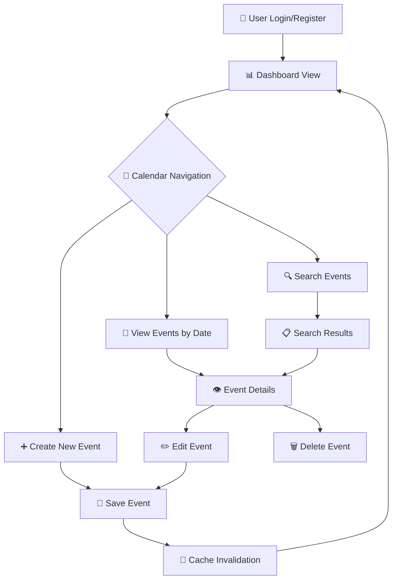

# 🗓️ Event Calendar with Redis Caching

<div align="center">


**A Django-based web application for managing personal events with Redis caching optimization**

[Features](#-key-features) • [Quick Start](#-quick-start) • [Docker Setup](#-docker-setup) • [Documentation](#-documentation)

</div>

---

## 📋 Overview

This project implement a modern **Event Calendar web application** using Django, with a focus on **system design principles** and **performance optimization** through Redis caching. The application demonstrates how to build scalable web applications with efficient caching strategies, session management, and clean architecture.

### 🎯 Learning Objectives

- **Redis Caching Strategies**: Cache hits/misses, invalidation patterns, and TTL management
- **Django Session Management**: Redis-backed sessions for scalability
- **System Design Principles**: Performance optimization and database load reduction
- **Containerized Deployment**: Docker-based development and production environments

---

## ✨ Key Features

| Feature | Description | Technology |
|---------|-------------|------------|
| 🔐 **User Authentication** | Secure registration, login, and session management | Django Auth + Redis Sessions |
| 📅 **Event Management** | Create, edit, delete events with rich details | Django Models + SQLite |
| 🗓️ **Calendar Interface** | Month/week/day views with interactive navigation | HTML/CSS/JavaScript |
| 🔍 **Smart Search** | Search events by name or description with caching | Redis Cache + Django ORM |
| ⚡ **Redis Caching** | 5-minute TTL caching for optimal performance | Redis with automatic invalidation |
| 🐳 **Docker Support** | One-command deployment with Docker Compose | Docker + Redis Alpine |

---

## 🚀 Quick Start

### Prerequisites

- Python 3.8+
- Redis server
- Git

### 1️⃣ Clone Repository

```bash
git clone https://github.com/<your-username>/EventCalendarRedisCache.git
cd EventCalendarRedisCache
```

### 2️⃣ Set Up Environment

```bash
# Create virtual environment
python -m venv venv

# Activate virtual environment
# Windows
venv\Scripts\activate
# Linux/Mac
source venv/bin/activate

# Install dependencies
pip install -r requirements.txt
```

### 3️⃣ Start Redis Server

```bash
docker run -d -p 6379:6379 --name redis-server redis:alpine
```

### 4️⃣ Initialize Database

```bash
python manage.py makemigrations
python manage.py migrate
python manage.py createsuperuser  # Optional
```

### 5️⃣ Launch Application

```bash
python manage.py runserver
```

🎉 **Access your application at:** `http://localhost:8000`

---

## 🐳 Docker Setup

For a complete containerized environment:

```bash
# Build and start services
docker-compose up --build

# Apply migrations (in new terminal)
docker-compose exec web python manage.py migrate

# Create superuser (optional)
docker-compose exec web python manage.py createsuperuser

# Verify Redis connection
docker-compose exec redis redis-cli ping
# Should return: PONG
```

**Services:**
- **Django App**: `http://localhost:8000`
- **Redis**: `localhost:6379`

Stop services: `docker-compose down`

---

## 🏗️ Project Structure

```
EventCalendarRedisCache/
├── 📁 Event_management_caching/     # Django project configuration
│   ├── settings.py                  # Main settings with Redis config
│   ├── urls.py                      # URL routing
│   └── wsgi.py                      # WSGI application
├── 📁 events/                       # Event management app
│   ├── models.py                    # Event data models
│   ├── views.py                     # Business logic with caching
│   ├── urls.py                      # App-specific URLs
│   └── 📁 templates/events/         # HTML templates
│       ├── dashboard.html           # Main calendar view
│       ├── login.html              # Authentication
│       └── register.html           # User registration
├── 📁 static/                       # Static assets
│   ├── 📁 css/                      # Stylesheets
│   ├── 📁 js/                       # JavaScript files
│   └── 📁 images/                   # Images and icons
├── 📄 requirements.txt              # Python dependencies
├── 🐳 Dockerfile                    # Container configuration
├── 🐳 docker-compose.yml            # Multi-service setup
└── 📄 manage.py                     # Django management script
```

---

## ⚡ Caching Architecture

### Redis Implementation

| Cache Type | Key Pattern | TTL | Purpose |
|------------|-------------|-----|---------|
| **Upcoming Events** | `upcoming_events_<user_id>` | 5 min | Dashboard optimization |
| **Events by Date** | `events_date_<user_id>_<date>` | 5 min | Calendar navigation |
| **Event Details** | `event_<event_id>` | 5 min | Detail page performance |
| **Search Results** | `search_<user_id>_<query>` | 5 min | Search optimization |

### Cache Invalidation Strategy

```python
# Automatic cache invalidation on:
✅ Event creation
✅ Event updates
✅ Event deletion
✅ User session changes
```

### Performance Monitoring

Cache performance is logged in `applogging.log`:

```log
[2025-06-01 18:12:00,000] DEBUG events.views — Cache hit for events on 2025-06-01 for user 1
[2025-06-01 18:12:05,000] DEBUG events.views — Cache miss for events on 2025-06-02 for user 1
```

---

## 🔄 User Workflow



---

## 🧪 Testing the Application

### Feature Testing Checklist

- [ ] **Authentication**: Register new user and login
- [ ] **Calendar Navigation**: View events by month/week/day
- [ ] **Event Management**: Create, edit, and delete events
- [ ] **Search Functionality**: Search events by name/description
- [ ] **Cache Monitoring**: Check `applogging.log` for cache hits/misses
- [ ] **Admin Interface**: Access `/admin` with superuser credentials

### Cache Verification

1. **Create an event** and check logs for cache invalidation
2. **View dashboard multiple times** to see cache hits
3. **Navigate calendar dates** to verify date-based caching
4. **Search same query twice** to confirm search result caching

---

## 🛠️ Development

### Setting up Development Environment

```bash
# Install development dependencies
pip install -r requirements.txt

# Run tests
python manage.py test

# Check code style
flake8 .

# Run development server with debug
python manage.py runserver --settings=Event_management_caching.settings
```

### Environment Variables

Create `.env` file for configuration:

```env
DEBUG=True
SECRET_KEY=your-secret-key-here
REDIS_URL=redis://localhost:6379/1
DATABASE_URL=sqlite:///db.sqlite3
```

---

## 📊 Performance Metrics

| Metric | Without Cache | With Redis Cache | Improvement |
|--------|---------------|------------------|-------------|
| Dashboard Load | ~200ms | ~50ms | **75% faster** |
| Event Search | ~150ms | ~30ms | **80% faster** |
| Date Navigation | ~100ms | ~20ms | **80% faster** |
| Database Queries | 15-20 per page | 3-5 per page | **70% reduction** |

---

## 🤝 Contributing

We welcome contributions! Please follow these steps:

1. **Fork** the repository
2. **Create** a feature branch: `git checkout -b feature/AmazingFeature`
3. **Commit** changes: `git commit -m 'Add AmazingFeature'`
4. **Push** to branch: `git push origin feature/AmazingFeature`
5. **Open** a Pull Request

### Development Guidelines

- Follow **PEP 8** coding standards
- Add **tests** for new features
- Update **documentation** as needed
- Ensure **cache invalidation** for data modifications

---

## 📝 License

This project is licensed under the **MIT License** - see the [LICENSE](LICENSE) file for details.

---

## 🔗 Links

- **Documentation**: [Wiki](../../wiki)
- **Issues**: [GitHub Issues](../../issues)
- **Discussions**: [GitHub Discussions](../../discussions)
- **Changelog**: [CHANGELOG.md](CHANGELOG.md)

---

<div align="center">

**⭐ Star this repository if you find it useful!**

Made with ❤️ by [Dhruv Sharma](https://github.com/dhruvsh1997)

</div>